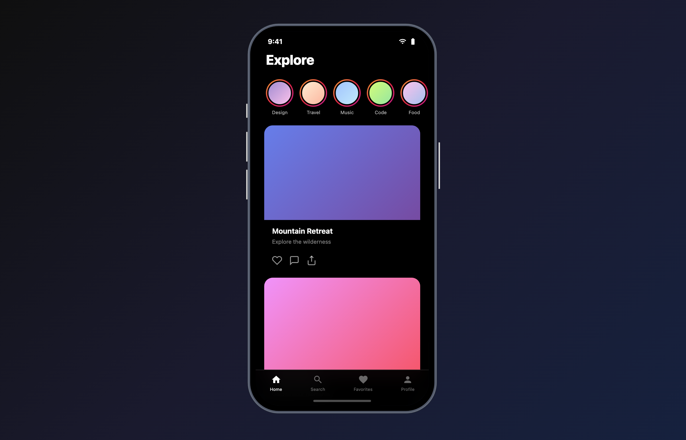
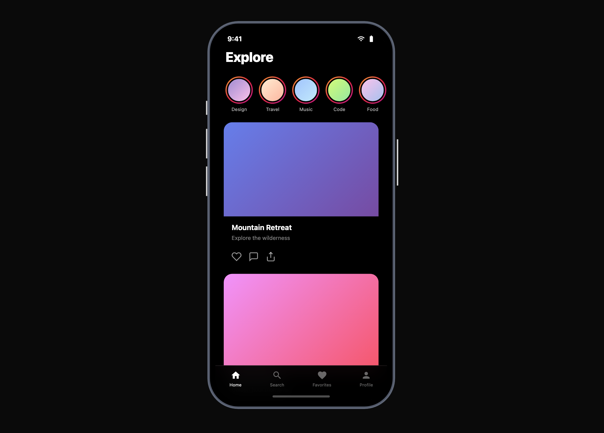
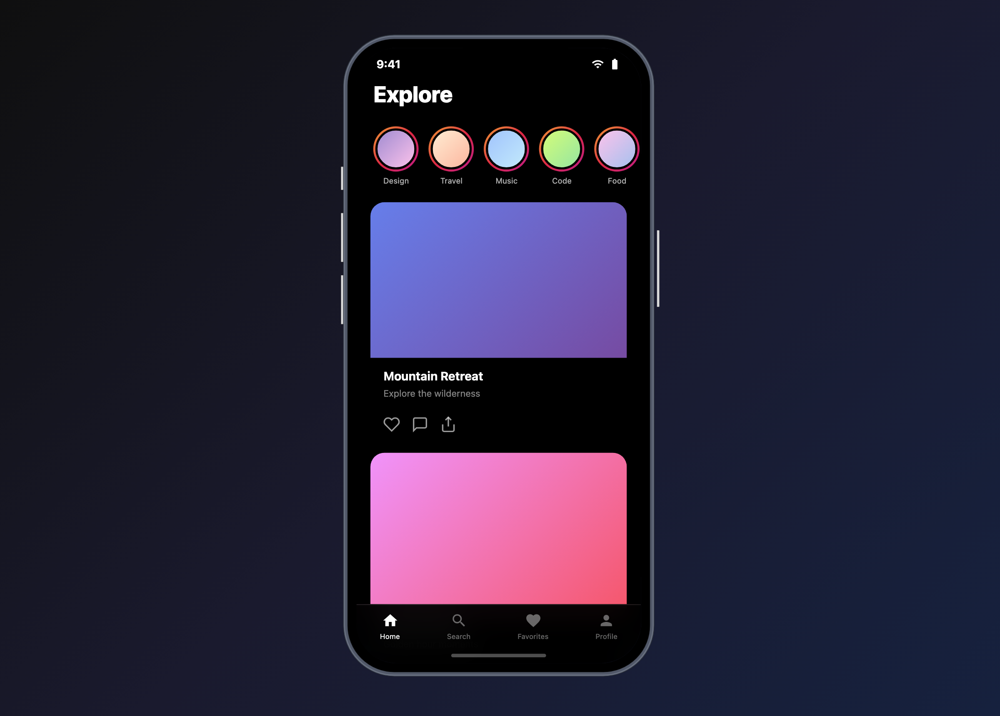
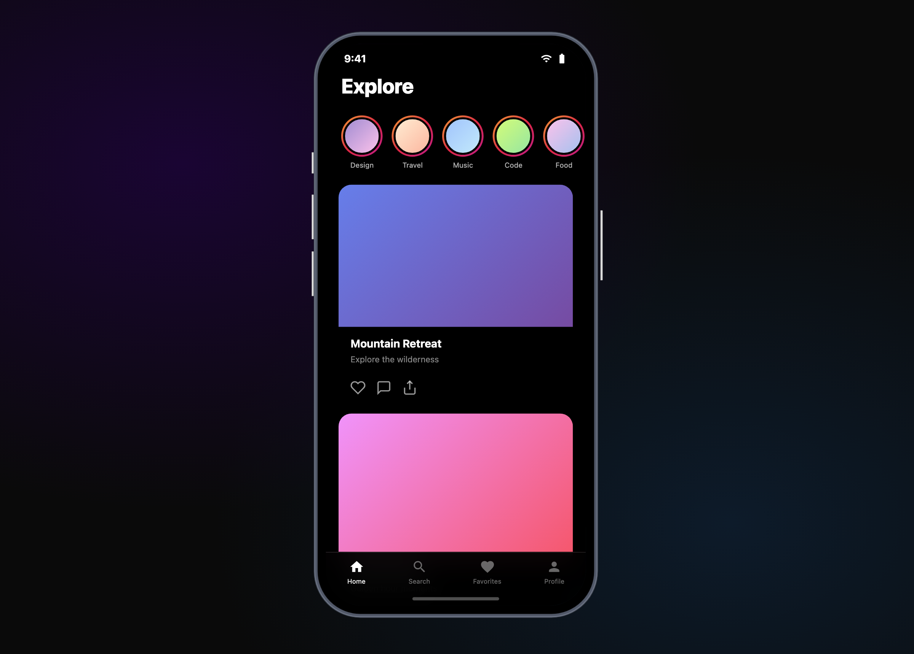
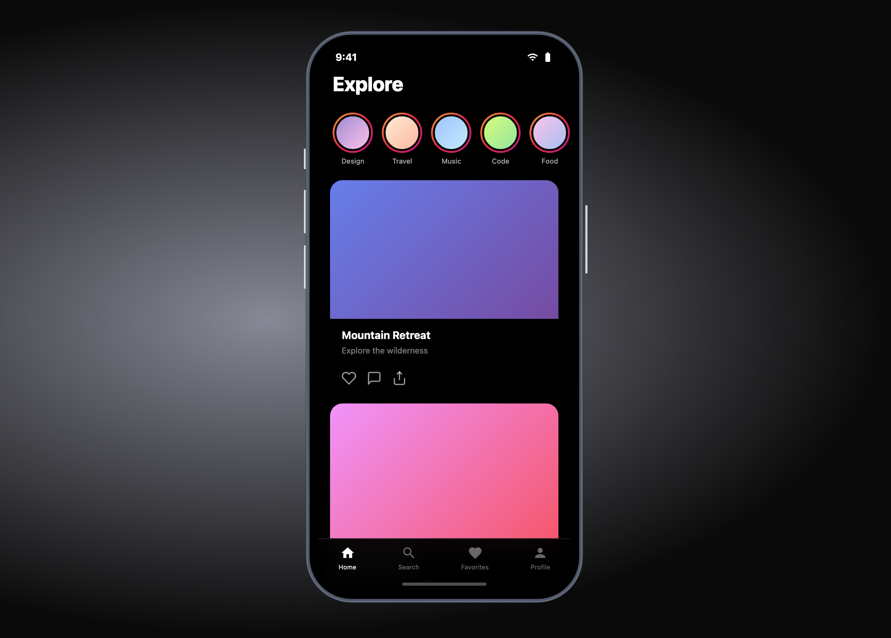
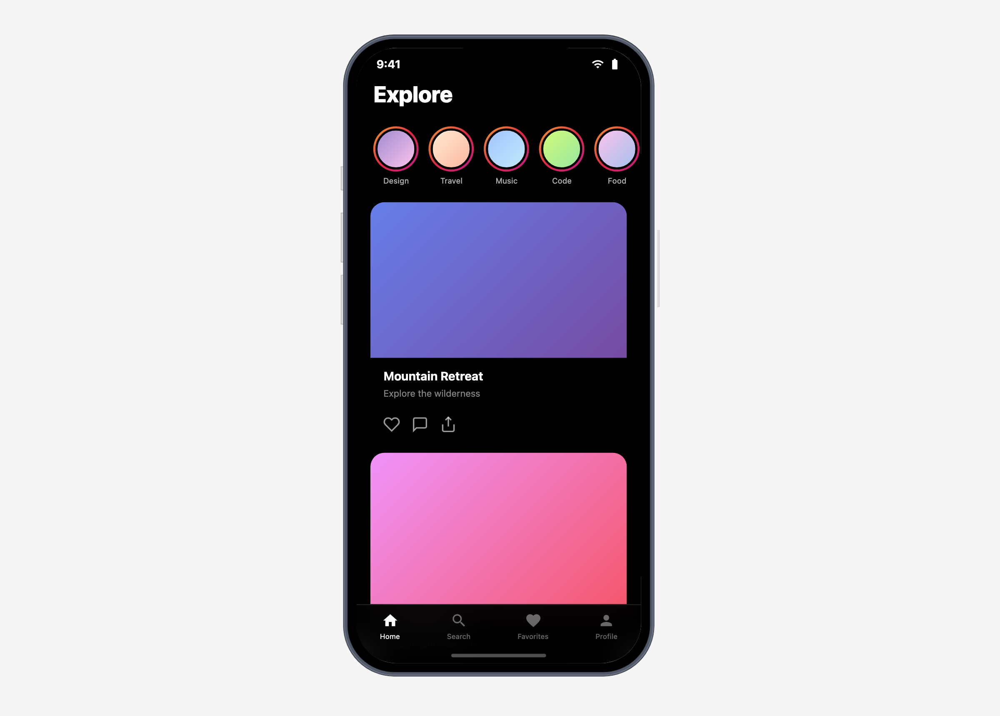

<p align="center">
  
</p>

<h1 align="center">MobileProto</h1>

<p align="center">
  <strong>Wrap any mobile-first web app in a realistic phone frame on desktop.</strong><br />
  On mobile, it stays out of the way completely.
</p>

<p align="center">
  <a href="https://www.npmjs.com/package/mobile-proto"></a>
  <a href="https://www.npmjs.com/package/mobile-proto"></a>
  <a href="https://bundlephobia.com/package/mobile-proto"></a>
  <a href="./LICENSE"></a>
  
</p>

<br />

## Features

- **One component** — wrap your app and you're done
- **5 background presets** — dark, light, gradient, blur, mesh
- **Custom backgrounds** — video, canvas, Three.js, anything
- **Swappable device frames** — iPhone default, or bring your own SVG
- **Zero dependencies** — only `react` and `react-dom` as peer deps
- **TypeScript-first** — full type definitions included

<br />

## Install

```bash
npm install mobile-proto
```

<details>
<summary>yarn / pnpm</summary>

```bash
yarn add mobile-proto
```

```bash
pnpm add mobile-proto
```

</details>

<br />

## Quick Start

```tsx
import { MobileFrameWrapper } from 'mobile-proto';
import 'mobile-proto/style.css';

function App() {
  return (
    <MobileFrameWrapper>
      <YourMobileApp />
    </MobileFrameWrapper>
  );
}
```

> Desktop/tablet viewers see an iPhone frame. Mobile users see your app normally.

<br />

## Background Presets

Choose from 5 built-in backgrounds via the `backgroundPreset` prop:

<table>
  <tr>
    <td align="center"><br /><code>dark</code></td>
    <td align="center"><br /><code>gradient</code></td>
    <td align="center"><br /><code>mesh</code></td>
  </tr>
  <tr>
    <td align="center"><br /><code>blur</code></td>
    <td align="center"><br /><code>light</code></td>
    <td></td>
  </tr>
</table>

```tsx
<MobileFrameWrapper backgroundPreset="gradient">
  <App />
</MobileFrameWrapper>
```

Or pass any React element as the background:

```tsx
<MobileFrameWrapper
  backgroundElement={
    <video src="/bg.mp4" autoPlay loop muted style={{ width: '100%', height: '100%', objectFit: 'cover' }} />
  }
>
  <App />
</MobileFrameWrapper>
```

<br />

## Framework Examples

<details>
<summary><strong>Vite + React</strong></summary>

```tsx
// main.tsx
import React from 'react';
import ReactDOM from 'react-dom/client';
import { MobileFrameWrapper } from 'mobile-proto';
import 'mobile-proto/style.css';
import App from './App';

ReactDOM.createRoot(document.getElementById('root')!).render(
  <React.StrictMode>
    <MobileFrameWrapper backgroundPreset="gradient">
      <App />
    </MobileFrameWrapper>
  </React.StrictMode>,
);
```

</details>

<details>
<summary><strong>Next.js (App Router)</strong></summary>

```tsx
// app/layout.tsx
import { MobileFrameWrapper } from 'mobile-proto';
import 'mobile-proto/style.css';

export default function RootLayout({ children }: { children: React.ReactNode }) {
  return (
    <html lang="en">
      <body>
        <MobileFrameWrapper backgroundPreset="dark">
          {children}
        </MobileFrameWrapper>
      </body>
    </html>
  );
}
```

</details>

<br />

## API

### `<MobileFrameWrapper>`

| Prop | Type | Default | Description |
|---|---|---|---|
| `children` | `ReactNode` | *required* | Your app content |
| `breakpoint` | `number` | `600` | Width (px) above which the frame appears |
| `backgroundPreset` | `'dark' \| 'light' \| 'gradient' \| 'blur' \| 'mesh'` | `'dark'` | Built-in background |
| `backgroundElement` | `ReactNode` | — | Custom background (overrides preset) |
| `frameSvg` | `ComponentType<FrameSvgProps>` | `IPhoneFrameSvg` | Custom device frame |
| `frameColor` | `string` | — | Tint the bezel color |
| `verticalPadding` | `number` | `40` | Edge padding (px) |
| `disabled` | `boolean` | `false` | Bypass the frame entirely |

### Hooks

| Hook | Returns | Description |
|---|---|---|
| `useIsDesktop(breakpoint?)` | `boolean` | `true` when viewport > breakpoint |
| `useFrameScale(padding?)` | `number` | 0–1 scale factor to fit viewport |

### Exports

```ts
import {
  MobileFrameWrapper,
  IPhoneFrameSvg,
  useIsDesktop,
  useFrameScale,
  backgroundPresets,
  PHONE_WIDTH,       // 451
  PHONE_HEIGHT,      // 914
} from 'mobile-proto';
```

<br />

## Custom Device Frames

Provide any component that accepts `className` and `style`:

```tsx
function PixelFrame({ className, style }: { className?: string; style?: React.CSSProperties }) {
  return <svg className={className} style={style} viewBox="0 0 400 800" fill="none">{/* ... */}</svg>;
}

<MobileFrameWrapper frameSvg={PixelFrame}>
  <App />
</MobileFrameWrapper>
```

> Use an SVG `<mask>` for the screen cutout. See `IPhoneFrameSvg` source for reference.

<br />

## How It Works

1. **Below breakpoint** (mobile) — children render normally, zero overhead
2. **Above breakpoint** (desktop/tablet) — your app renders inside an `<iframe>` at mobile width, wrapped in a centered phone frame with auto-scaling

<br />

## Contributing

```bash
npm install   # install deps
npm run build # compile
```

PRs welcome. Fork, branch, commit, open a PR.

<br />

## License

[MIT](./LICENSE)
